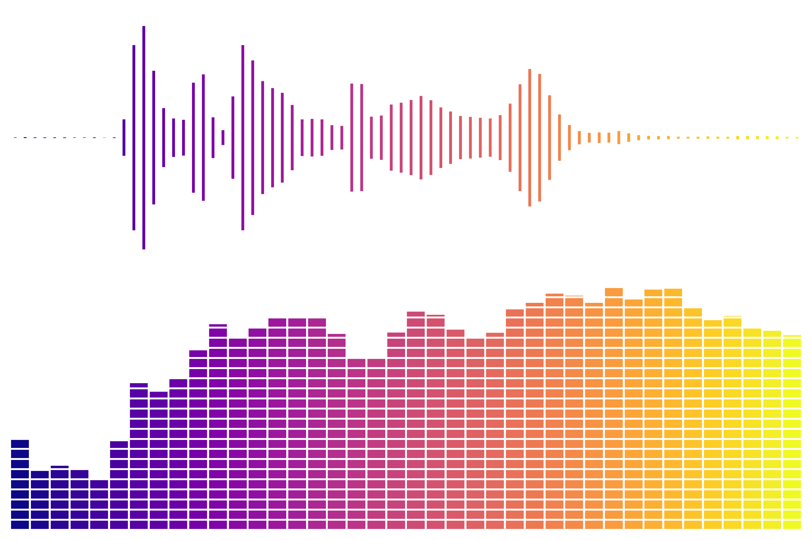

# Assignment #1 – *Sound is Art!*  

**Yann Ducrest – s251889@dtu.dk**  
*Course 22051: Signals and Linear Systems in Discrete Time*  

## Project Overview  

This project turns a short **speech recording** into **digital sound art** using concepts from **Digital Signal Processing (DSP)**.  
It blends **time-domain** and **frequency-domain** analyses to generate colorful, symmetric, and abstract visualizations.  

You speak into the mic, and DSP transforms it into art!  

## Setup Instructions  

### 1. Create and Activate Virtual Environment  

```bash
# Windows (PowerShell)
py -m venv .venv
.venv\Scripts\Activate.ps1

# macOS/Linux
python3 -m venv .venv
source .venv/bin/activate
````

### 2. Install Dependencies

```bash
pip install -r requirements.txt
```

**requirements.txt**

```
numpy
scipy
soundfile
matplotlib
ipykernel
```

## Usage

1. Place your **speech file** as `data/voice.wav`.

2. Run the notebook: `sound_is_art.ipynb`.

3. Plots will be generated in the `plots/` folder:

   * `1_waveform.png` → speech waveform
   * `2_envelopes_full.png` → envelope extraction
   * `3_symmetric_pattern.png` → artistic symmetric pattern
   * `4_spectrum.png` → FFT spectrum
   * `5_spectrum_and_bands.png` → band aggregation
   * `6_artistic_combo.png` → **final artwork** 

## Repository Structure

```
SOUND-IS-ART/
├── .venv/                 # Virtual environment
├── data/
│   └── voice.wav          # Input speech recording
├── plots/                 # Output visualizations
│   ├── 1_waveform.png
│   ├── 2_envelopes_full.png
│   ├── 3_symmetric_pattern.png
│   ├── 4_spectrum.png
│   ├── 5_spectrum_and_bands.png
│   └── 6_artistic_combo.png
├── sound_is_art.ipynb     # Main notebook
├── requirements.txt
└── README.md
```

## Example Output

The final visualization combines:

* **Envelope-based pattern** → rhythm & phrasing 
* **Spectrum bands** → frequency energy profile 

Result: a colorful **sound-as-art image** directly derived from your own speech!



Enjoy turning your **voice into art** using **DSP concepts**!